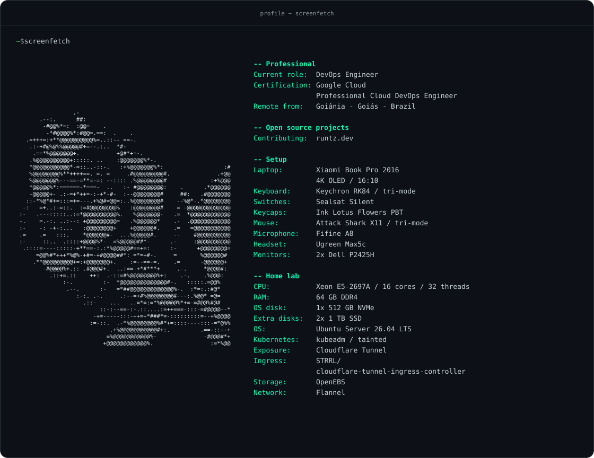

<!-- Edit scripts/render_readme.py and run python3 scripts/render_readme.py to update this profile. -->

<p align="center">
  
</p>

<p align="center">Contributing to <a href="https://runtz.dev">runtz.dev</a></p>

<details>
<summary>Plain-text version</summary>

```text
$ screenfetch

                 .-                                                -- Professional
       .--:.      ##:                                              Current role:  DevOps Engineer
        -#@@%*=:  :@@=    .                                        Certification: Google Cloud
         -*#@@@@%*:#@@=.==:  .    .                                               Professional Cloud DevOps Engineer
   .=+++=:+**@@@@@@@@@@%=..::-- ==-.                               Remote from:   Goiânia - Goiás - Brazil
    .:-+#@%@%%@@@@@#+=--.:..  *#-
     .==*%@@@@@@@+.           +@#*+=-.                             -- Setup
    .%@@@@@@@@@@+:::::. ..    :@@@@@@@%*-.                         Laptop:        Xiaomi Book Pro 2016
    *@@@@@@@@@@@*-=::..-::-.   :+%@@@@@@@%*:                  :#                  4K OLED / 16:10
    %@@@@@@@@%**++++==. =. =     .#@@@@@@@@@#.              .+@@   Keyboard:      Keychron RK84 / tri-mode
    %@@@@@@@%---==-=**=-=: --:::: .%@@@@@@@@#             :+%@@@   Switches:      Sealsat Silent
    *@@@@@%*:======-*===-  ..   :- #@@@@@@@@:    .      .*@@@@@@   Keycaps:       Ink Lotus Flowers PBT
    -@@@@@+- .:-=+*++=-:-+*-#-  :--@@@@@@@@#     ##:   .#@@@@@@@   Mouse:         Attack Shark X11 / tri-mode
   ::-*%@*#+=:::=+=---.+%@#=@@=:..%@@@@@@@@#    --%@*-.*@@@@@@@@   Microphone:    Fifine A8
  -:   =+..:-=::.  :=#@@@@@@@@%   :@@@@@@@@#    = -@@@@@@@@@@@@@   Headset:       Ugreen Max5c
 :-   .---:::::..:=*@@@@@@@@@@%.   %@@@@@@@-   .=  *@@@@@@@@@@@@   Monitors:      2x Dell P2425H
 -.    =.-:. ..:--: +@@@@@@@@@=   .%@@@@@@*    .-  .@@@@@@@@@@@@
 :-    -: -+-:...   :@@@@@@@@+    +@@@@@@#.    .=   =@@@@@@@@@@@   -- Home lab
 .=    .=   :::.    *@@@@@@#-  ...%@@@@@#.     --    #@@@@@@@@@@   CPU:           Xeon E5-2697A / 16 cores / 32 threads
 :-     ::..  .::::+@@@@%*-  =%@@@@@##*-      .-     :@@@@@@@@@@   RAM:           64 GB DDR4
  .::::=----:::::-+**==-:.:*%@@@@@#==+=:      :-      +@@@@@@@@=   OS disk:       1x 512 GB NVMe
      =@@%#*+++*%@%-+#=-+#@@@@##*: =*=+#-.     =       %@@@@@@#    Extra disks:   2x 1 TB SSD
     .**@@@@@@@@@+=:+@@@@@@@+.    :=--==-=.    .=      -@@@@@@+    OS:            Ubuntu Server 26.04 LTS
        -#@@@@%+.:: .#@@@#+.  ..:==-+*#***+     .-.     *@@@@#:    Kubernetes:    kubeadm / tainted
          .::+=.::    ++:  .-::=#%@@@@@@@@%+:    .-.    .%@@@:     Exposure:      Cloudflare Tunnel
              :-.         :-  *@@@@@@@@@@@@@@#-.   :::::.=@@%      Ingress:       STRRL/
               .--.      :-   =*##@@@@@@@@@@@@@%-.  :*=:.:#@*                     cloudflare-tunnel-ingress-controller
                  :-:. .-.     .:--=+#%@@@@@@@@#---:.%@@* =@=      Storage:       OpenEBS
                    .::-    ...   ..=*=:=*%@@@@@%*+=-=#@@%#@#      Network:       Flannel
                         ::-:--==-:-.::....:=++===-:::-=#@@@@--*
                       -+=-----:::-++=+*###*=-:::::::::=--+%@@@@   -- Open source projects
                      :=-::.  .-*%@@@@@@@@%#*+=::::----:::-=*@%%   Contributing:  runtz.dev
                            .+%@@@@@@@@@@@#+:.         .==-::--+
                           =%@@@@@@@@@@@%-              -#@@@#*+
                          +@@@@@@@@@@@@%.                 :=*%@@
```

</details>
